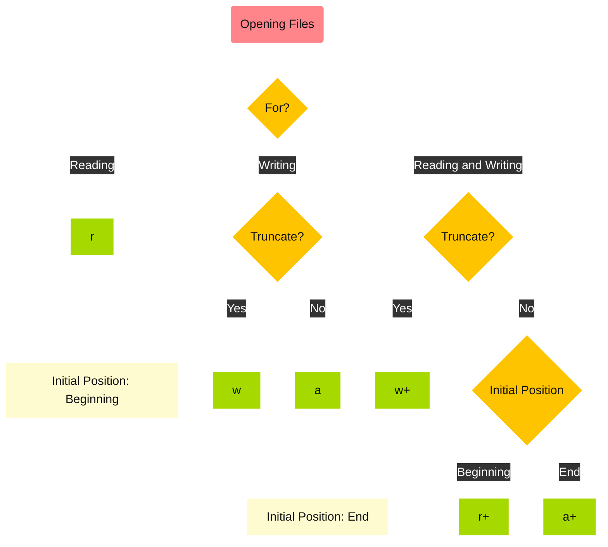

# File Opening Modes — Flowchart

```mermaid
%%{init: {"theme": "dark", "themeVariables": {
  "background": "#1E1E1E",
  "primaryColor": "#A6D900",
  "primaryTextColor": "#111111",
  "primaryBorderColor": "#FFFFFF",
  "secondaryColor": "#FFC400",
  "secondaryTextColor": "#111111",
  "secondaryBorderColor": "#FFFFFF",
  "tertiaryColor": "#FFFBD0",
  "lineColor": "#FFFFFF",
  "textColor": "#F5F5F5",
  "edgeLabelBackground": "#333333",
  "fontSize": "18px"
}}}%%

flowchart TD
    A("Opening Files") --> B{"For?"}

    B -->|Reading| C["r"]
    C --> C1["Initial Position: Beginning"]

    B -->|Writing| D{"Truncate?"}
    D -->|Yes| E["w"]
    D -->|No| F["a"]
    F --> F1["Initial Position: End"]

    B -->|Reading and Writing| G{"Truncate?"}
    G -->|Yes| H["w+"]
    G -->|No| I{"Initial Position"}

    I -->|Beginning| J["r+"]
    I -->|End| K["a+"]

    classDef start fill:#FF858B,stroke:#FFFFFF,stroke-width:2px,color:#111111
    classDef decision fill:#FFC400,stroke:#FFFFFF,stroke-width:2px,color:#111111
    classDef mode fill:#A6D900,stroke:#FFFFFF,stroke-width:2px,color:#111111
    classDef note fill:#FFFBD0,stroke:#FFFFFF,stroke-width:2px,color:#111111

    class A start
    class B,D,G,I decision
    class C,E,F,H,J,K mode
    class C1,F1 note

    linkStyle default stroke:#FFFFFF,stroke-width:3px,color:#FFFFFF
```
